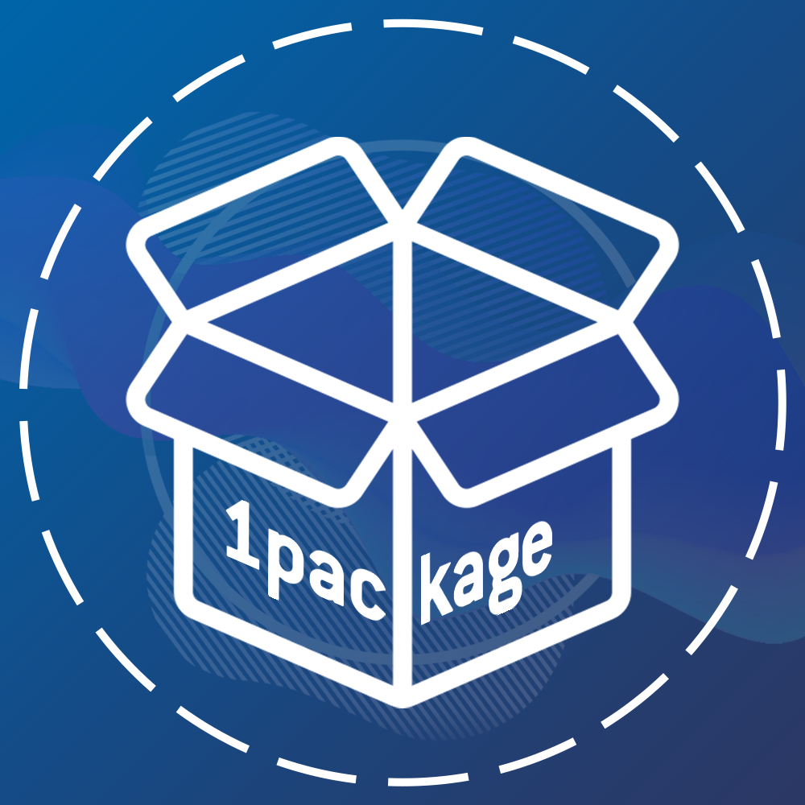

<h1>
👋 Good day!
</h1>

	
	

<h1>
🔗 Participation in projects
</h1>

	<a href="https://t.me/OnePackage" target="_blank">
		📦 All in 1package
	</a>
	  
	

<h1>
📊 Stats
</h1>

	
	

         

	

<h1>
🛠 Tools used
</h1>

<a href="https://en.wikipedia.org/wiki/Android_(operating_system)" target="_blank" rel="noopener">  </a> <a>  </a>    

